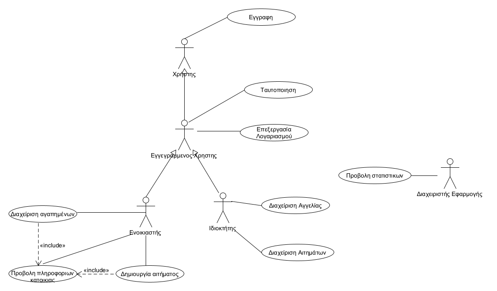
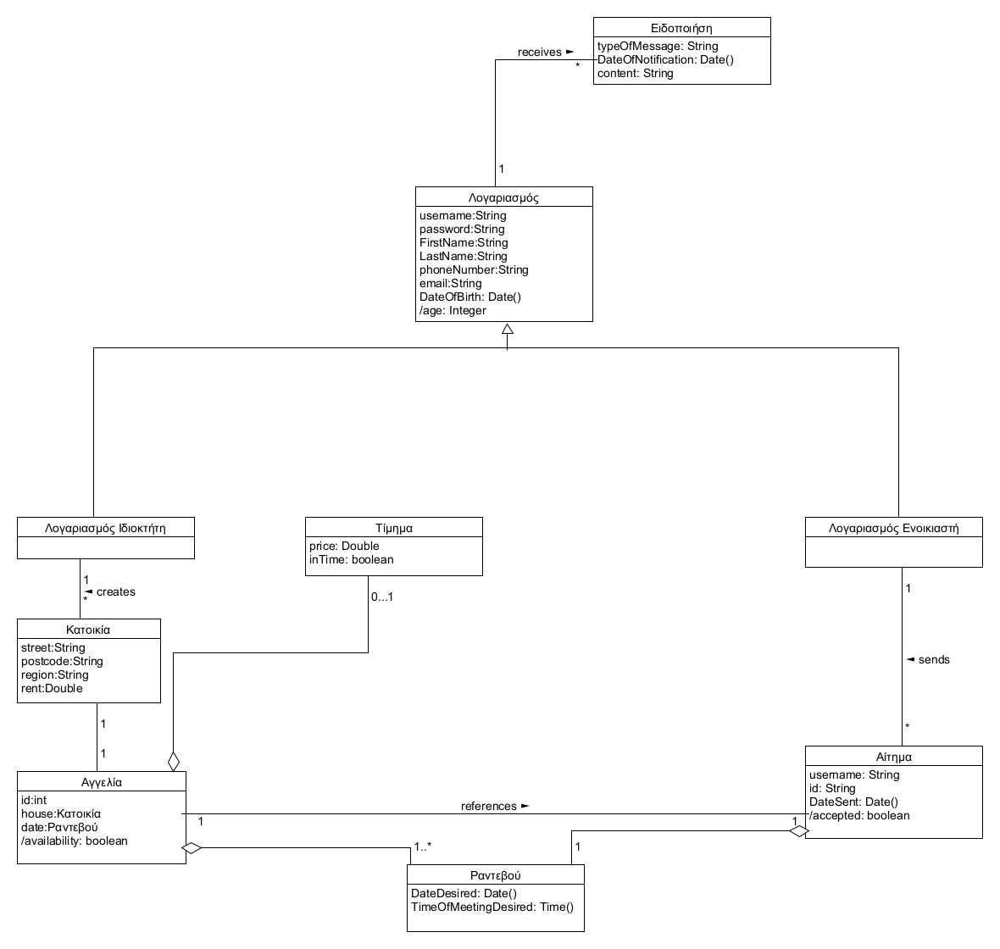
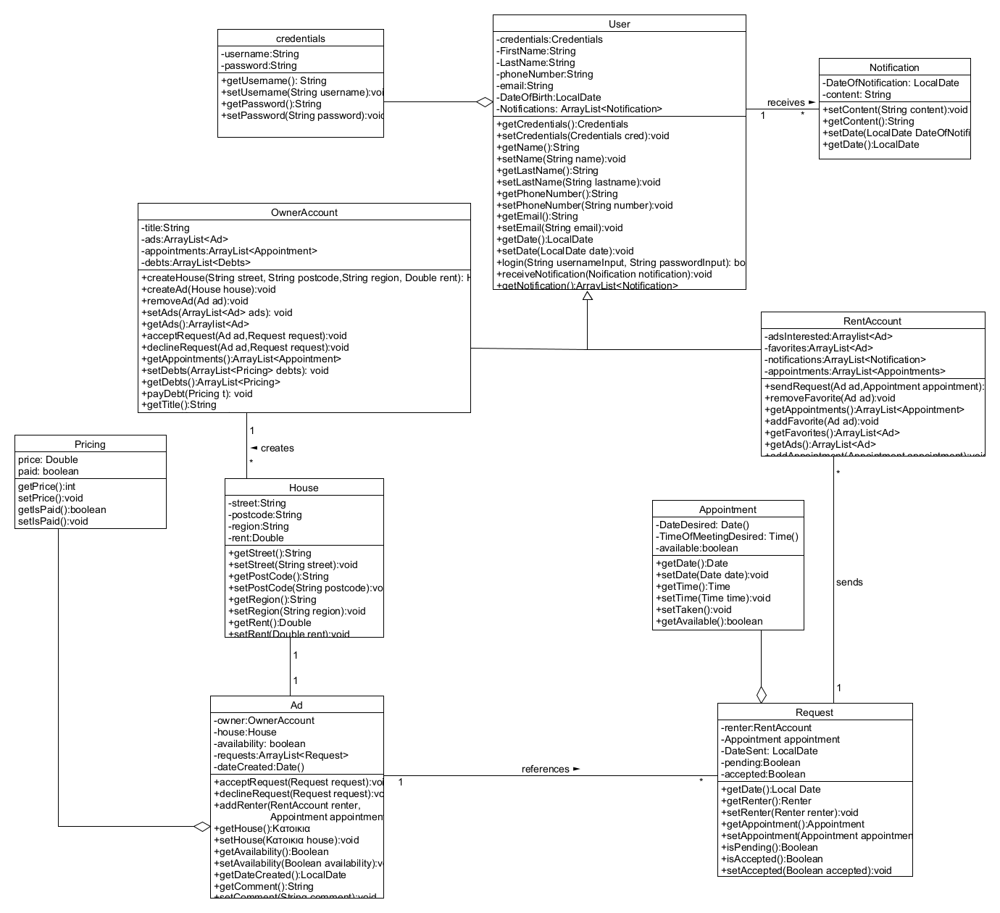

# Εισαγωγή

Το παρόν έγγραφο αφορά το δεύτερο παραδοτέο(**R2**). Γενικά, όπως κιόλας μας ζητείται, γίνεται ανάλυση των απαιτήσεων λογισμικού και του συστήματος. Πιο συγκεκριμένα, περιέχει συμπληρωματικές προδιαγραφές για τις μη λειτουργικές απαιτήσεις του συστήματος. Επίσης, περιέχει το μοντέλο πεδίου που περιλαμβάνει βασικές κλάσεις(ιδιότητες και σχέσεις) του πεδίου προβλήματος και γίνεται περιγραφή των σεναρτίων εκτέλεσεις(διαγράμματα ακολουθίας) των σημαντικότερων σεναρίων χρήσεις. Τέλος, κάθε περίπτωση χρήσης αντιστοιχίζεται με έναν σύνδεσμο που καταλήγει σε ένα .md αρχείο στο οποίο αναλύεται πλήρως. 

**Τα διαγράμματα για το τελευταίο παραδοτέο βρίσκονται** [**εδώ**](C:\Users\user\Desktop\team11\docs\markdown\r4-diagrams.md)

# Συνολική περιγραφή

## Επισκόπηση μοντέλου περιπτώσεων χρήσης

### **Πίνακας περιπτώσεων χρήσης**
Περιπτώση Χρήσης |  Περιγραφή
------------ | --------------
**ΠΧ1. Εγγραφή χρήστη** | Ο χρήστης δημιουργεί τον δικό του λογαριασμό και τον αξιοποιεί αναλόγως τις προθέσεις του.
**ΠΧ2. Ταυτοποίηση χρήστη** | Ο χρήστης κατά την είσοδο του οφείλει να συμπληρώσει username(ή email) και password για ασφαλή ταυτοποιήση.
**ΠΧ3. Επεξεργασία λογαριασμού** | Ο χρήστης έχει την δυνατότητα να αλλάξει τα στοιχεία του λογαριασμού του ή ακόμη και να τον διαγράψει εντελώς.
**ΠΧ4. Προβολή πληροφοριών αγγελίας** | Ο ενοικιαστής μέσω αναζήτησης επιλέγει μια κατοικία και του προβάλονται όλες οι διαθέσιμες πληροφορίες.
**ΠΧ5. Δημιουργία αιτήματος** | Ο ενοικιαστής που ενδιαφέρεται για μια κατοικία στέλνει αίτημα στον ιδιοκτήτη
**ΠΧ6. Διαχείριση αγαπημένων** | Ο ενοικιαστής έχει τη δυνατότητα να αποθηκεύσει(ή να αφαιρέσει) κατοικίες που του κινούν το ενδιαφέρον.
**ΠΧ7. Διαχείριση αγγελιών** | Ο ιδιοκτήτης δημιουργεί μια αγγελία(για την κατοικία του) όπου μπορεί να επεξεργάζεται ανα πάσα στιγμή.
**ΠΧ8. Διαχείριση αιτημάτων** | Ο ιδιοκτήτης αποδέχεται ή απορρίπτει αιτήματα ενδιαφερόμενων ενοικιαστών.
**ΠΧ9. Προβολή στατιστικών** | Οι διαχειριστές της εφαρμογής θα μπορέσουν να δουν στατιστικά για τρέχουσες εξελίξεις των λειτουργιών.

# Ειδικές Απαιτήσεις 

## Περιπτώσεις χρήσης

### Οι ενδιαφερόμενοι και οι ανάγκες τους

Ενδιαφερόμενος | Ανάγκη
------------ | --------------
*Χρήστης* | Επιθυμεί να εγγράφεται στην πλατφόρμα ώς(Ενοικιαστής, Ιδιοκτήτης). 
*Εγγεγραμένος Χρήστης* | Εφόσον έχει εγγραφεί, ταυτοποιείται και επιθυμεί να αξιοποιήσει τον λογαριασμό του με βάση τις προθέσεις του.
*Ιδιοκτήτης* | Επιθυμεί να δημιουργεί και να διαχειρίζεται αγγελίες κατοικιών και να αποδέχεται συγκεκριμένα αιτήματα ενδιαφερόμενων. 
*Ενοικιαστής* | Επιθυμεί να αναζητά μία αγγελία και να του παρέχονται όλες οι κατάλληλες πληροφορίες για αυτή. Επίσης, επιθυμεί να δημιουργεί αίτημα για μια αγγελία που τον ενδιαφέρει.

### Actors του συστήματος

Actors | Περιγραφή
------------ | --------------
*Χρήστης* | Κάνει εγγραφή στο σύστημα.
*Εγγεγραμένος Χρήστης* | Ταυτοποιείται και κάνει περιήγηση στην εφαρμογή(μόνο αν έχει κάνει εγγραφή) για να χρησιμοποιήσει όλες τις δυνατότητες τις εφαρμογής.
*Ιδιοκτήτης* | Είναι ένας εγγεγραμένος χρήστης που δημιουργεί και διαχειρίζεται αγγελίες. Επίσης διαχειρίζεται αιτήματα ενδιαφερόμενων προς αυτές.
*Ενοικιαστής* | Είναι ένας εγγεγραμένος χρήστης που αναζητά αγγελία και δημιουργεί αίτηματα για τυχόν κατοικίες που τον ενδιαφέρουν.

### Περιγραφές περιπτώσεων χρήσης

#### [ΠΧ1 Εγγραφή Χρήστη](uc1-sign-in.md)

#### [ΠΧ2 Ταυτοποίηση Χρήστη](uc2-verify-user.md)

#### [ΠΧ3 Διαχείριση λογαριασμού](uc3-account-management.md)

#### [ΠΧ4 Προβολή πληροφοριών αγγελίας](uc4-view-info.md)

#### [ΠΧ5 Δημιουργία Αιτήματος](uc5-create-request.md)

#### [ΠΧ6 Διαχείριση αγαπημένων](uc6-manage-preferences.md)

#### [ΠΧ7 Διαχείριση αγγελιών](uc7-manage-ads.md)

#### [ΠΧ8 Διαχείριση αιτημάτων](uc8-manage-requests.md)

#### [ΠΧ9 Προβολή στατιστικών](uc9-statistics.md)

## Συμπληρωματικές προδιαγραφές

\[*Οι επόμενες ενότητες περιέχουν όλες τις μη λειτουργικές απαιτήσεις και τους περιορισμούς σχεδίασης και υλοποίησης.*\]

### Απαιτήσεις διεπαφών

#### Διεπαφές χρήστη

1. Κουμπιά σύνδεσης στο σύστημα για ταυτοποίηση και εγγραφή.
2. Κουμπιά για την επιλογή τύπου λογαριασμού κατά την εγγραφή(Ιδιοκτήτης, Ενοικιαστής).
3. Φόρμα εισαγωγής στοιχείων κατα την εγγραφή και την ταυτοποίηση.
4. Ιδιοκτήτης: Κουμπιά για δημιουργία αγγελίας, τροποποίησης στοιχείων αγγελίας με φόρμα εισαγωγής στοιχείων, διαγραφή αγγελίας. 
5. Ενοικιαστής: Πεδίο συμπλήρωσης με φίλτρο(περιοχή, οδός) για αναζήτηση αγγελίας. Κουμπιά για προσθήκη στα αγαπημένα και εμφάνιση αγαπημένων , κλείσιμο ραντεβού για μια διαθέσιμη αγγελία. 
6. Για όλους τους χρήστες θα υπάρχει κουμπί για τροποποίηση στοιχείων λογαριασμού που θα εμφανίζεται μια φόρμα εισαγωγής στοιχείων και σε περίπτωση διαγραφής θα υπάρχει κατάλληλο κουμπί επίσης.
7. Για όλους τους χρήστες θα εμφανίζεται χάρτης με όλες τις διαθέσιμες αγγελίες και εικόνες στην συγκεκριμένη οδό που βρίσκονται αυτές.
8. Ιδιοκτήτης: Κουμπί ειδοποιήσεων για εμφάνιση όλων των αιτημάτων, κουμπί για αποδοχή η απόρριψη αιτήματος.
9. Ενοικιαστής: Κουμπί ειδοποιήσεων για εμφάνιση την κατάσταση των αιτημάτων.

#### Διεπαφές υλικού

Απαιτείται οθόνης αφής ανεξαρτήτως διαστάσεων.

#### Διεπαφές επικοινωνίας

Απαιτείται σύνδεση στο διαδίκτυο(και google maps).

#### Διεπαφές λογισμικού

Το λογισμικό λειτουργεί μόνο σε συσκευές με Λειτουργικό Σύστημα Android(έχουμε καλύψει όλες τις εκδόσεις).

### Περιορισμοί σχεδίασης και υλοποίησης

Η υλοποίηση της εφαρμογής θα γίνει με την χρήση Java, στο περιβάλλον Android Studio.

### Ποιοτικά χαρακτηριστικά

#### Απόδοση

Όλες οι λειτουργίες του συστήματος θα πρέπει να γίνονται σε πραγματικό χρόνο. Θα πρέπει να υπάρχει άμεση αποστολή των αιτημάτων και των αποδοχών ή απορρίψεων. Επίσης άμεσα θα πρέπει να στέλνονται οι ειδοποιήσεις για το τίμημα και για το email verification.

#### Διαθεσιμότητα

1. Απόκτηση του λογισμικού θα γίνεται μέσω του αρχείου .apk. Άλλη επιλογή είναι install μέσω του google play.
2. Η εφαρμογή θα είναι διαθέση διαρκώς.
3. Ο χρόνος μη διαθεσιμότητας δεν θα πρέπει να ξεπερνάει το 5%.

#### Ασφάλεια

Οι δυνατότητες που παρέχονται για κάθε χρήστη γίνονται με βάση τον τύπο του λογαριασμόυ που δημιουργόυν και περαιτέρω κατα την ταυτοποίηση τους. Έτσι κάθε ενοικιαστής μπορεί να επεξεργαστεί τα στοιχεία του ή τα αγαπημένα του μόνο όταν έχει ταυτοποιηθεί. Με τον ίδιο τρόπο και κάθε ιδιοκτήτης προστατεύεται, ώστε να έχει πρόσβαση στις δικές του αγγελίες και αιτήματα.

#### Ευελιξία

1. Η επεξεργασία των στοιχείων μιάς αγγελίας θα μπορούν να γίνονται σε διάστημα 15 ημερών απο την δημιουργία τους .
2. Το τίμημα θα μπορεί να πληρώνεται σε διάστημα 10 ημερών μετά την ειδοποίηση .

#### Ευχρηστία

Πρώτος στόχος είναι να δημιουργήσουμε μια απλή εφαρμογή ώστε ο χρήστης να μπορεί να περιηγηθεί με λίγες γνώσεις. Τα στοιχεία(κείμενα, εικόνες κλπ) της εφαρμογής θα έχουν κατάλληλο μέγεθος για να διακρίνονται εύκολα καθώς δεν θα χρησιμοποιηθούν έντονα χρώματα. Σε κάθε δραστηριότητα θα υπάρχουν στοιχεία αναγκαία για τους στόχους του κάθε χρήστη.

# Υποστηρικτικό υλικό

## Μοντέλο πεδίου

### Συμπεριφορές

## Επιχειρησιακοί κανόνες

\[*Ένας πίνακας με του επιχειρησιακούς κανόνες. Βλέπε πίνακα 3-4 του παραδείγματος 3-1 στη σελίδας 133 του βιβλίου.*\]

| Επιχειρησιακοί κανόνες | Περιγραφή |
|:-----------------------| :---------|
| ΕΚ1                    | Το username του χρήστη είναι μοναδικό
| ΕΚ2                    | Ο χρήστης πρέπει να είναι άνω των 16 χρονών 
| ΕΚ3                    | Το τηλέφωνο του χρήστη πρέπει να αποτελείται απο 10 ψηφία
| ΕΚ4                    | Το email πρέπει να είναι της μορφής: **name@emailserver.com**.
| ΕΚ5                    | Το username και password πρέπει να αποτελείται απο 4-20 χαρακτήρες
| ΕΚ6                    | Η τιμή του ενοικίου ανά μήνα πρέπει να είναι μεγαλύτερο των 50 ευρώ
| ΕΚ7                    | Το όριο των αιτημάτων αγγελίας για ιδιοκτήτες που δεν έχουν συνδρομή είναι 50
| ΕΚ8                    | Το χρονικό όριο διαθεσιμότητας μιας αγγελίας για ιδιοκτήτες που δεν εχουν συνδρομή είναι 1 μήνας
| ΕΚ9                    | Ο ιδιοκτήτης που δεν πληρώνει το τίμημα μέσα στις επόμενες 10 μέρες δεν θα έχει πρόσβαση στο λογαριασμό του
| ΕΚ10                   | Ο CVV κωδικός κάρτας πρέπει να είναι τριψήφιος 
| ΕΚ11                   | Ο αριθμός των αριθμός δωματίων της κατοικίας(αριθμός μπάνιων, υπνοδωματίων, κουζίνας) πρέπει να είναι μεγαλυτερος του μηδενός
| ΕΚ12                   | Ο αριθμός κάρτας πρέπει να είναι 16
