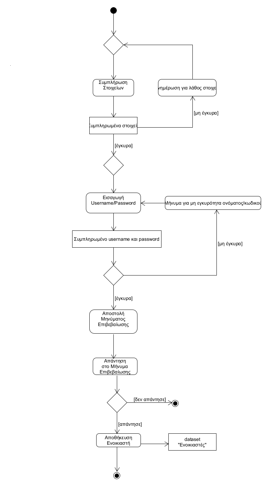
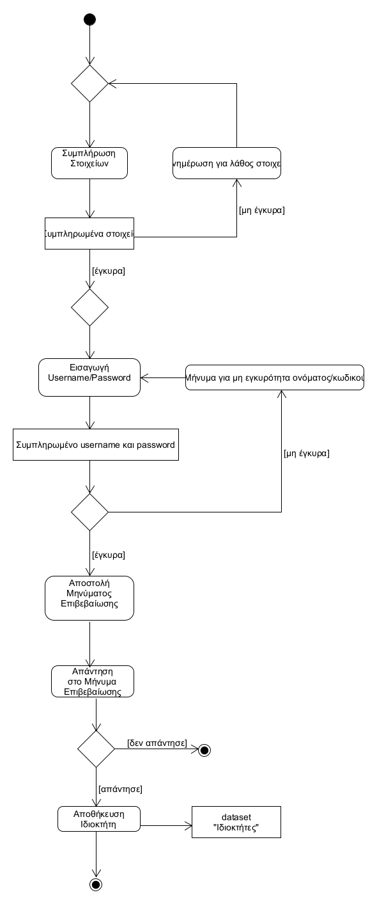
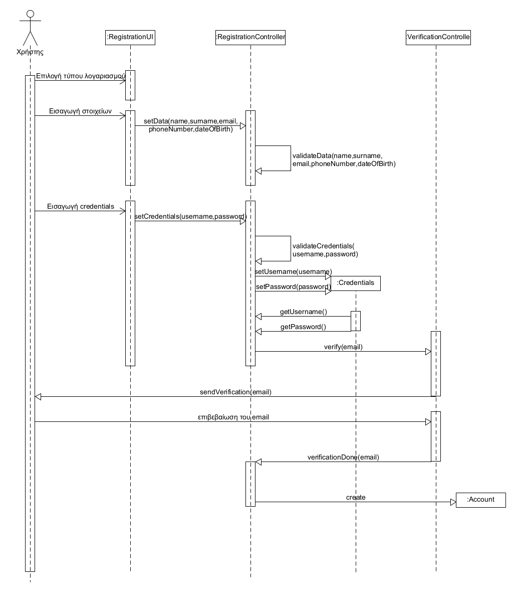

# ΠΧ1. Εγγραφή χρήστη

**Πρωτεύων Actor**: Χρήστης

**Ενδιαφερόμενοι**

**Χρήστης**: θέλει να δημιουργήσει λογαριασμό στην πλατφόρμα και να επεξεργάζεται ανα πάσα στιγμή τα στοιχεία του.

**Προϋποθέσεις**: Ο χρήστης έχει ανοίξει την εφαρμογή.

## Βασική Ροή

### Α) Εγγραφή ως Ενοικιαστής

1. Ο Ενοικιαστής συμπληρώνει τα στοιχεία του: ονοματεπώνυμο, τηλέφωνο, email, ημερομηνία γέννησης..
2. Το σύστημα επιβεβαιώνει το αν είναι ορθά τα στοιχεία που εισήχθαν.
3. Ο χρήστης εισάγει username και password για τον λογαριασμό.
4. Το σύστημα ελέγχει την ορθότητα των στοιχείων.
5. Το σύστημα στέλνει μήνυμα επιβεβαίωσης στο email του χρήστη.
6. Ο χρήστης επιβεβαιώνει την εγγραφή του.
7. Το σύστημα αποθηκεύει τον νέο χρήστη και τα στοιχεία του.

**Εναλλακτικές Ροές**

*2α. Κάποιο απο τα στοιχεία δεν είναι έγκυρα διότι δεν τηρούνται οι εξής κανόνες:*[ΕΚ2,ΕΚ3,ΕΚ4](software-requirements.md#επιχειρησιακοί-κανόνες)
1. Το σύστημα ζητάει απο τον χρήστη να αλλάξει τα σημεία που υπάρχει λάθος.
2. Η ΠΧ επιστρέφει στο βημα 1.

*4α. Το username ή το password δεν ειναι έγκυρα διότι δεν τηρούνται οι εξής κανόνες:*[ΕΚ1,ΕΚ5](software-requirements.md#επιχειρησιακοί-κανόνες)
1. Το σύστημα ζητάει απο τον χρήστη να αλλάξει τα σημεία που υπάρχει λάθος.
2. Η ΠΧ επιστρέφει στο βήμα.

*6α. Ο χρήστης δεν έχει επιβεβαιώσει την εγγραφή του*
1. Η εγγραφή δεν γίνεται και τερματίζει η ΠΧ.

### Β) Εγγραφή ώς Ιδιοκτήτης

1. Ο Ιδιοκτήτης συμπληρώνει τα στοιχεία του:
2. Το σύστημα επιβεβαιώνει το αν είναι ορθά τα στοιχεία που εισήχθαν.
   * *2α. Κάποιο απο τα στοιχεία δεν είναι έγκυρα διότι δεν τηρούνται οι εξής κανόνες:*[ΕΚ2,ΕΚ3,ΕΚ4](software-requirements.md#επιχειρησιακοί-κανόνες)
   1. Το σύστημα ζητάει απο τον χρήστη να αλλάξει τα σημεία που υπάρχει λάθος.
   2. Η ΠΧ επιστρέφει στο βημα 1.
3. Ο χρήστης εισάγει username και password για τον λογαριασμό.
4. Το σύστημα ελέγχει την ορθότητα των στοιχείων.
    * *4α. Το username ή το password δεν ειναι έγκυρα διότι δεν τηρούνται οι εξής κανόνες:*[ΕΚ1,ΕΚ5](software-requirements.md#επιχειρησιακοί-κανόνες)
    1. Το σύστημα ζητάει απο τον χρήστη να αλλάξει τα σημεία που υπάρχει λάθος.
    2. Η ΠΧ επιστρέφει στο βήμα 4 της βασικής ροής
5. Το σύστημα στέλνει μήνυμα επιβεβαίωσης στο email του χρήστη.
6. Ο χρήστης επιβεβαιώνει την εγγραφή του.
    * *6α. Ο χρήστης δεν έχει επιβεβαιώση την εγγραφή του*
    1. Η εγγραφή δεν γίνεται και τερματίζει η ΠΧ.
7. Το σύστημα αποθηκεύει τον νέο χρήστη και τα στοιχεία του.

## Διαγράμματα

### Διάγραμμα δραστηριότητας για Σενάριο Χρήσης *"Εγγραφή ως Ενοικιαστής"*

### Διάγραμμα δραστηριότητας για Σενάριο Χρήσης *"Εγγραφή ως Ιδιοκτήτης"*

### Διάγραμμα ακολουθίας για Σενάριο Χρήσης *"Εγγραφή"*

