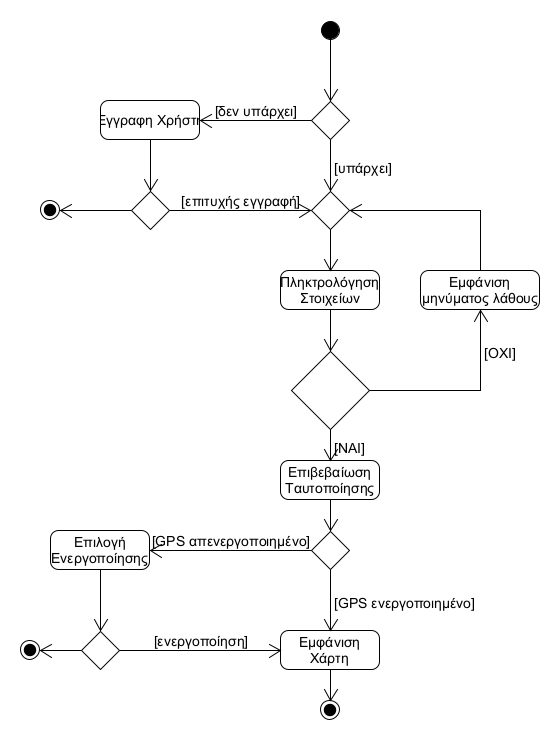
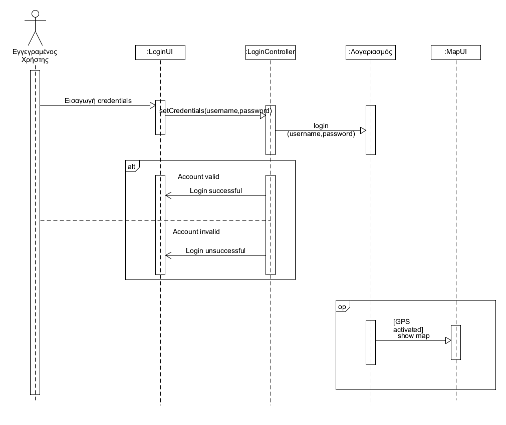

# ΠΧ2. Ταυτοποίηση Χρήστη

**Πρωτεύων Actor**: Εγγεγραμένος Χρήστης

**Ενδιαφερόμενοι**

**Εγγεγραμένος Χρήστης**: επιθυμεί να ταυτοποιηθέι.   

**Προϋποθέσεις**: Έχει εγγραφεί και βρίσκεται στο σημείο ταυτοποίησης

## Βασική Ροή

### Α) Ταυτοποίηση Χρήστη

1. Ο χρήστης πληκτρολογεί τα στοιχεία του λογαριασμού του(username, password)
2. Το σύστημα επιβεβαιώνει τα στοιχεία.
3. Το σύστημα εμφανίζει τον χάρτη σε μορφή google maps

**Εναλλακτικές Ροές**

*2α. Ο συνδυασμός των στοιχείων που δόθηκε δεν είναι έγκυρος.*
1. Το σύστημα εμφανίζει κατάλληλο μήνυμα λάθους("Invalid username and password")
2. Η ΠΧ επιστρέφει στο βήμα 1.

*3α. Ο χρήστης δεν έχει ενεργοποιημένο gps*
1. Το σύστημα δίνει επιλογή για ενεργοποιήση gps
2. Το βήμα επιστρέφει στο βήμα 4

## Διαγράμματα

### Διάγραμμα δραστηριότητας για Σενάριο Χρήσης *"Ταυτοποίηση Χρήστη"*

### Διάγραμμα ακολουθίας για Σενάριο Χρήσης *"Ταυτοποίηση Χρήστη"*

