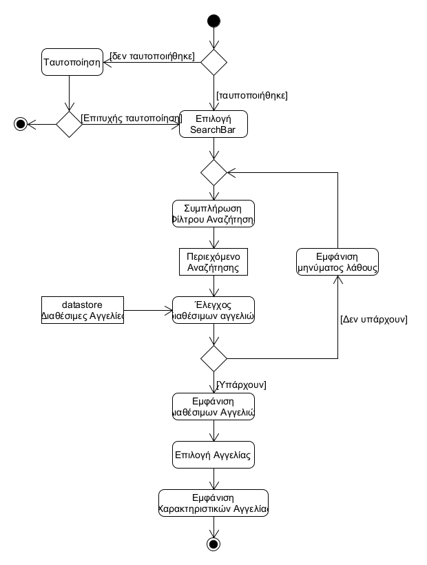
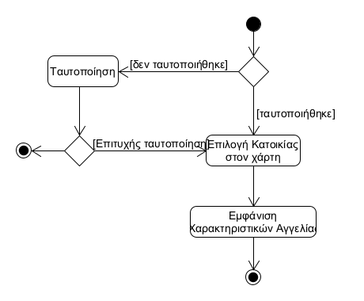
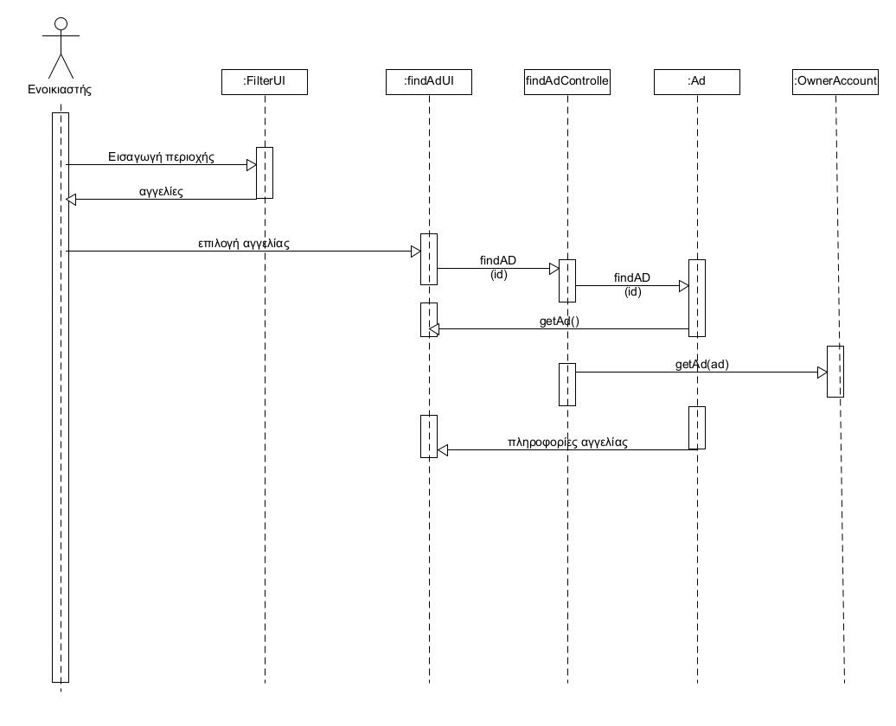

# ΠΧ4. Προβολή πληροφοριών κατοικίας

**Πρωτεύων Actor**: Ενοικιαστής

**Ενδιαφερόμενοι**

**Ενοικιαστής**: Ενδιαφέρεται να αναζητήσει και να δεί τις πληροφορίες μιας κατοικίας που τον ενδιαφέρει

**Προϋποθέσεις**: Έχει ταυτοποιηθεί

*Βασική Ροή*

### Α) Αναζήτηση μέσω search bar

1)Ο χρήστης πληκτρολογεί μία περιοχή(ή οδό) ώς φίλτρο αναζήτησης.

2)Το σύστημα εμφανίζει με βάση το φίλτρο τις διαθέσιμες αγγελίες.

3)Ο χρήστης επιλέγει μία αγγελία.

4)Το συστημα εμφανίζει όλες τις πληροφορίες για την κατοικία.

**Εναλλακτικές Ροές**

*2α. Δεν υπάρχουν διαθέσιμες αγγελίες με βάση την αναζήτηση*
1. Το σύστημα εμφανίζει κατάλληλο μήνυμα
2. Επανερχμόμαστε στο βήμα 1

### Β)Αναζήτηση μέσω χάρτη

1) Ο χρήστης επιλέγει πάνω στον χάρτη μία κατοικία που του κινεί το ενδιαφέρον.
2) Το σύστημα εμφανίζει όλες τις πληροφορίες για την κατοικία.

## Διαγράμματα

### Διάγραμμα δραστηριότητας για Σενάριο Χρήσης *"Αναζήτηση μέσω search bar"*

### Διάγραμμα δραστηριότητας για Σενάριο Χρήσης *"Αναζήτηση μέσω χάρτη"*

### Διάγραμμα ακολουθίας για Σενάριο Χρήσης *"Προβολή Πληροφοριών κατοικίας"*

