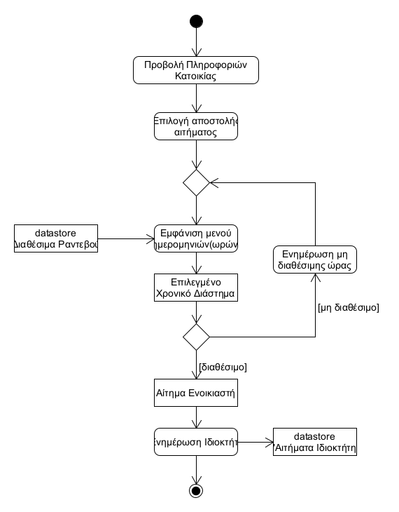
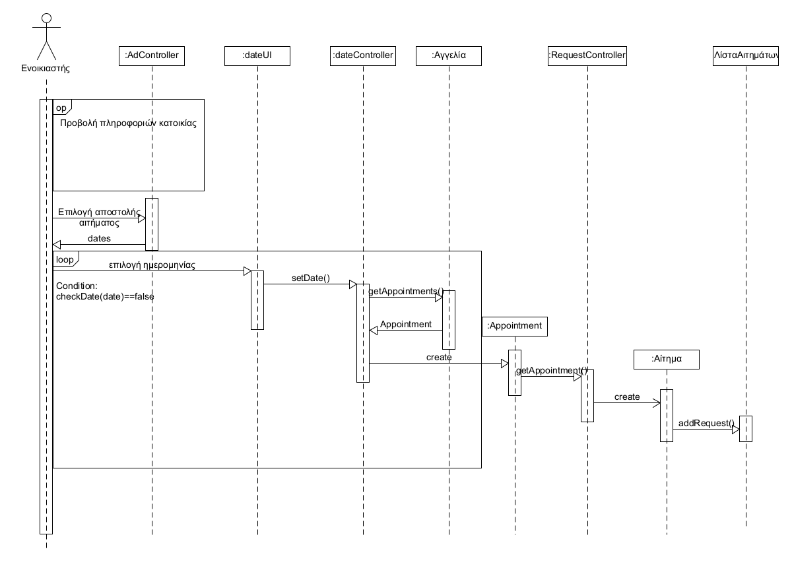

# ΠΧ5. Δημιουργία αιτήματος

**Πρωτεύων Actor**: Ενοικιαστής

**Ενδιαφερόμενοι**

**Ενοικιαστής**: Ενδιαφέρεται να στείλει αίτημα για μία κατοικία που τον ενδιαφέρει

**Ιδιοκτήτης**: Ενημερώνεται για το αίτημα που δημιουργήθηκε

**Προϋποθέσεις**: Υπάρχουν διαθέσιμες αγγελίες

**Βασική Ροή**

### Α) Δημιουργία αιτήματος

1) [Προβολή πληροφοριών κατοικίας](uc4-view-info.md)
2) Ο χρήστης επιλέγει την αποστολή αιτήματος.
3) Το σύστημα εμφανίζει ημερομηνίες και ώρες για να κλείσει ραντεβού με τον ιδιοκτήτη.
4) Ο χρήστης επιλέγει μια ημερομηνία.
5) Το σύστημα ενημερώνει τον ιδιοκτήτη για το αίτημα.

##Εναλλακτική ροή

*4α. Η ημερομηνία δεν είναι διαθέσιμη*
1) Το σύστημα εμφανίζει κατάλληλο μήνυμα.
2) Επιστρέφουμε στο βήμα 3.

## Διαγράμματα

### Διάγραμμα δραστηριότητας για Σενάριο Χρήσης *"Δημιουργία αιτήματος"*

### Διάγραμμα ακολουθίας για Σενάριο Χρήσης *"Δημιουργία αιτήματος"*

