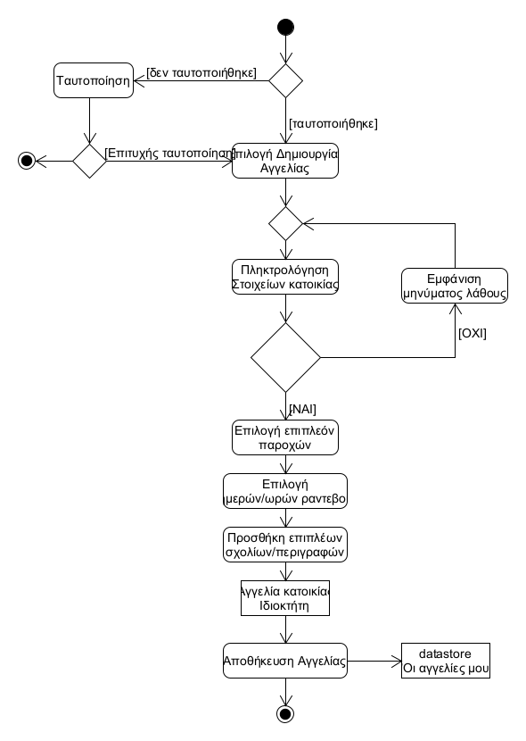
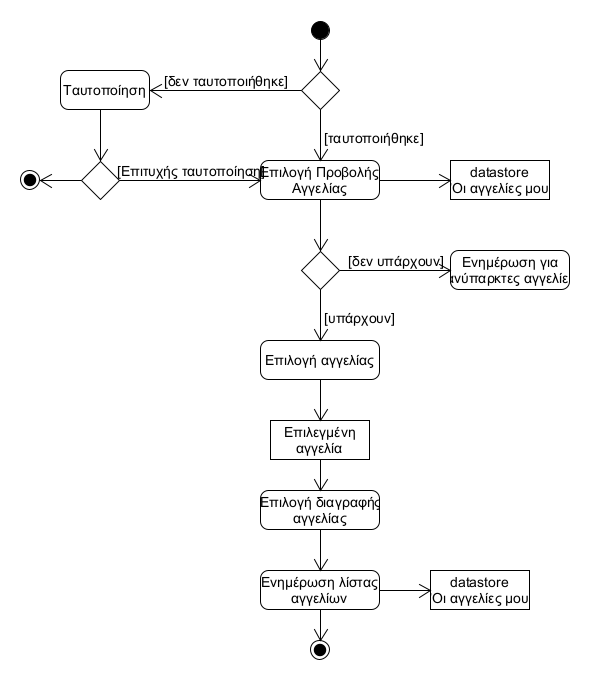
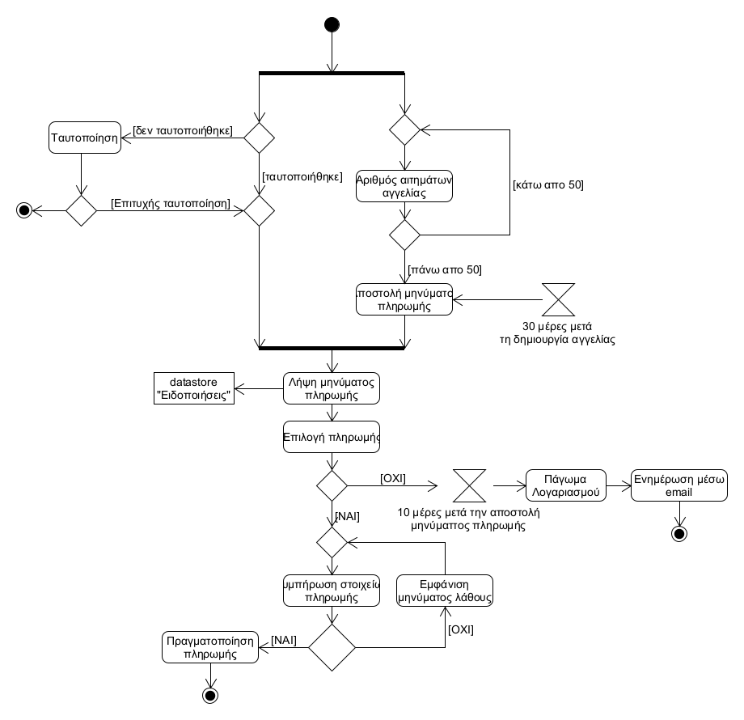
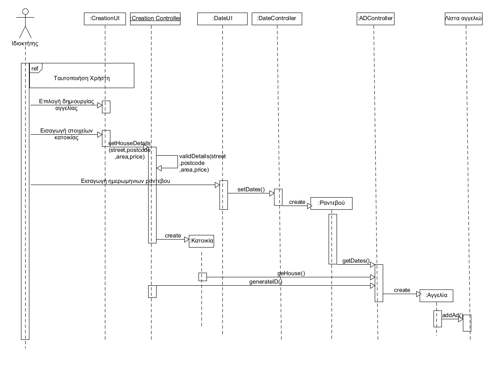
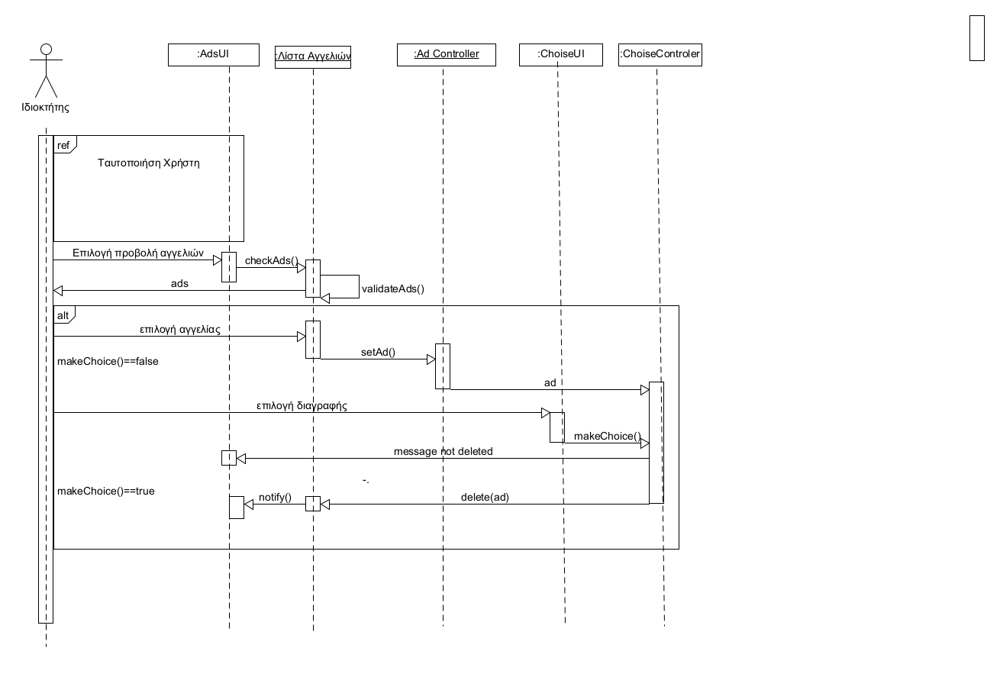
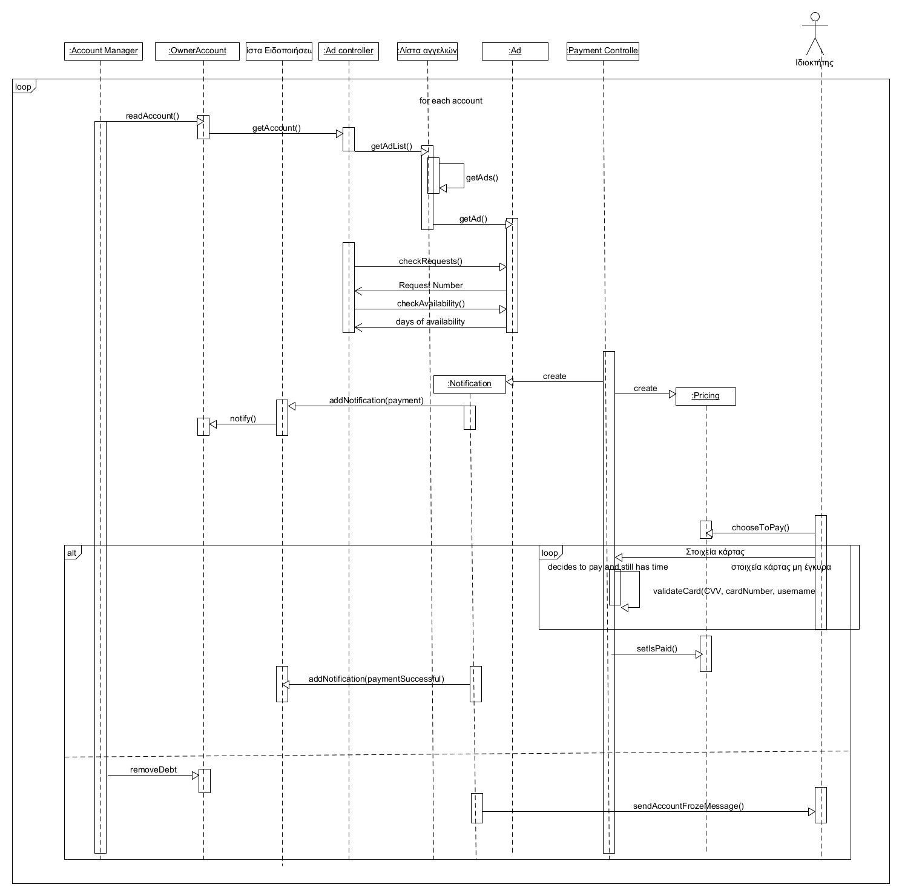

# ΠΧ7. Διαχείριση Αγγελιών

**Πρωτεύων Actor**: Ιδιοκτήτης

**Ενδιαφερόμενοι**

**Ιδιοκτήτης**: Ενδιαφέρεται να δημιουργήσει μια αγγελία ή να επεξεργαστεί στοιχεία ήδη υπάρχουσας

**Προϋποθέσεις**: Έχει ταυτοποιηθεί 

*Βασική Ροή*

### Α) Δημιουργία αγγελίας

1) Ο ιδιοκτήτης επιλέγει την δημιουργία αγγελίας.
2) Το σύστημα ζητάει απο τον ιδιοκτήτη να συμπληρώσει τα βασικά στοιχεία της κατοικίας .
2) Ο ιδιοκτήτης συμπληρώνει τα στοιχεία της κατοικίας του: Οδός, ΤΚ, Περιοχή, Τιμή, αριθμός μπάνιων,....
3) Το σύστημα ελέγχει αν είναι έγκυρα τα στοιχεία.
4) Το σύστημα ζητάει απο τον ιδιοκτήτη να επιλέξει άλλες επιπλέον παροχές που διαθέτει η κατοικία: Wifi, bbq, Κλιματισμός κλπ\
5) Ο ιδιοκτήτης επιλέγει κατάλληλα τις παροχές που θέλει.
6) Το σύστημα ζητάει απο τον ιδιοκτήτη να προσθέσει ημερομηνίες και ώρες για ραντεβού.
7) Ο ιδιοκτήτης συμπληρώνει κατάλληλα τα χρονικά διαστήματα.
8) Το σύστημα ζητάει απο τον ιδιοκτήτη να προσθέσει άλλα σχόλια (περιγραφές) για την αγγελία.
9) Ο ιδιοκτήτης πληκτρολογεί τα σχόλια που θέλει και δημιουργεί την αγγελία.
10) Το σύστημα αποθηκεύει την αγγελία και τα στοιχεία της.

**Εναλλακτική Ροή**

*3α. Κάποιο απο τα στοιχεία δεν είναι έγκυρα με βάση τους κανόνες.*[ΕΚ6,ΕΚ11](software-requirements.md#επιχειρησιακοί-κανόνες)
1) Το σύστημα ζητάει απο τον ιδιοκτήτη να αλλάξει τα στοιχεία που υπάρχει λάθος.
2) Επανερχόμαστε στο βήμα 2.

### Β) Επεξεργασία στοιχείων αγγελίας 

1) Ο ιδιοκτήτης επιλέγει να δεί τις αγγελίες του.
2) Το σύστημα εμφανίζει τις αποθηκευμενες αγγελίες του ιδιοκτήτη.
3) Ο ιδιοκτήτης επιλέγει μία αγγελία.
4) Το σύστημα εμφανίζει τα στοιχεία της αγγελίας.
5) Ο ιδιοκτήτης εισάγει τις αλλαγές στα στοιχεία που επιθυμεί.
6) Το σύστημα ελέγχει αν είναι ορθά τα στοιχεία.
    * *6α. Κάποιο απο τα στοιχεία δεν είναι έγκυρα με βάση τους κανόνες.*[ΕΚ6,ΕΚ11](software-requirements.md#επιχειρησιακοί-κανόνες)
    1) Το σύστημα ζητάει απο τον ιδιοκτήτη να αλλάξει τα στοιχεία που υπάρχει λάθος.
    2) Επανερχόμαστε στο βήμα 5.
7) Το σύστημα αποθηκεύει τις αλλαγές.

### Γ) Διαγραφή αγγελίας

1) Ο ιδιοκτήτης επιλέγει να δεί τις αγγελίες του.
2) Το σύστημα εμφανίζει τις αποθηκευμενες αγγελίες του ιδιοκτήτη.
3) Ο ιδιοκτήτης επιλέγει μία αγγελία.
4) Το σύστημα εμφανίζει την διαγραφή της αγγελίας.
5) Ο ιδιοκτήτης επιλέγει την διαγραφή.
6) Το σύστημα ενημερώνει τη λίστα των αγγελίων.

### Δ) Πληρωμή Τιμήματος

1) Το σύστημα ελέγχει τις αποθηκευμένες αγγελίες του ιδιοκτήτη.
    * *1α) Όλες οι κατοικίες πληρούν τα όρια με βάση τους κανόνες:*[ΕΚ7,ΕΚ8](software-requirements.md#επιχειρησιακοί-κανόνες)
    1) επιστρεφουμε στο βημα 1.
2) Εμφανίζει κατάλληλο μήνυμα στον ιδιοκτήτη για να πληρώσει το τίμημα.
3) Ο ιδιοκτήτης επιλέγει αν θέλει να πληρώσει το τίμημα.
    * *3α) Ο ιδιοκτήτης δεν πληρώνει το τίμημα με βάση τον κανόνα:*[ΕΚ9](software-requirements.md#επιχειρησιακοί-κανόνες)
   1) Το σύστημα παγώνει τον λογαριασμό του χρήστη.
   2) Το σύστημα στέλνει κατάλληλο email στον ιδιοκτήτη.
   3) Η περίπτωση χρήσης τερματίζει
4) Το σύστημα ζητάει απο τον ιδιοκτήτη να συμπληρωσεί τα στοιχεία κάρτας: Αριθμός κάρτας, CVV ,ονοματεπώνυμο
5) Ο ιδιοκτητης συμπληρώνει τα στοιχεία.
6) Το σύστημα ελέγχει αν τα στοιχεία είναι έγκυρα.
    * *6α) Κάποιο απο τα στοιχεία της κάρτας δεν είναι έγκυρα με βάση τον κανόνα:*[ΕΚ10, ΕΚ12](software-requirements.md#επιχειρησιακοί-κανόνες)
    1) Το σύστημα ζητάει απο τον χρήστη να αλλάξει τα σημεία όπου υπάρχει λάθος.
    2) Επιστρέφουμε στο βήμα 5.
7) Το σύστημα πραγματοποιεί την πληρωμή και στέλνει email στον ιδιοκτήτη.

## Διαγράμματα

### Διάγραμμα δραστηριότητας για Σενάριο Χρήσης *"Δημιουργία αγγελίας"*

### Διάγραμμα δραστηριότητας για Σενάριο Χρήσης *"Διαγραφή αγγελίας"*

### Διάγραμμα δραστηριότητας για Σενάριο Χρήσης *"Πληρωμή Τιμήματος"*

### Διάγραμμα ακολουθίας για Σενάριο Χρήσης *"Δημιουργία Αγγελίας"*

### Διάγραμμα ακολουθίας για Σενάριο Χρήσης *"Διαγραφή Αγγελίας"*

### Διάγραμμα ακολουθίας για Σενάριο Χρήσης *"Πληρωμή Τιμήματος"*

