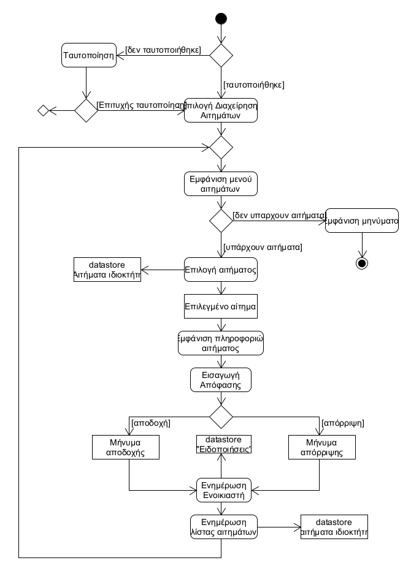
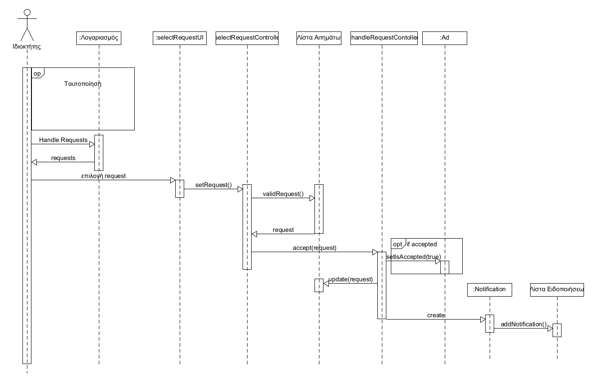

# ΠΧ8. Διαχείριση Αιτημάτων

**Πρωτεύων Actor**: Ιδιοκτήτης

**Ενδιαφερόμενοι**

**Ιδιοκτήτης**: Ενδιαφέρεται να αποδεχτεί ή να απορρίψει το αίτημα ενός ενοικιαστή.

**Ενοικιαστής**: Ενδιαφέρεται να ενημερωθεί άν το αίτημα του έγινε αποδεκτό.

**Προϋπόθεσεις**: Υπάρχουν αιτήματα για την συγκεκριμένη αγγελία

*Βασική Ροή*

### Α) Αποδοχή ή απόρριψη αιτήματος

1) Ο ιδιοκτήτης επιλέγει την διαχείριση αιτημάτων
2) Το σύστημα ελέγχει αν υπάρχουν αιτήματα
3) Το σύστημα εμφανίζει όλα τα αιτήματα που έχουν σταλεί στον ιδιοκτήτη 
4) Ο ιδιοκτήτης επιλέγει ένα αίτημα
5) Το σύστημα εμφανίζει όλες τις πληροφορίες του αιτήματος: Για ποιά αγγελία είναι το αίτημα, ποιός είναι ο ενδιαφερόμενος, την ημερομηνία του ραντεβού.
6) Ο ιδιοκτήτης επιλέγει να αποδεχτεί το αίτημα.
7) Το σύστημα ενημερώνει τον ενοικιαστή ότι το αίτημα του έγινε αποδεκτό.
8) Το σύστημα ενημερώνει την λίστα αιτημάτων.
9) Το σύστημα ενημερώνει την κατάσταση αγγελίας σε ΜΗ διαθέσιμη.

**Εναλλακτική Ροή**

*2α. Δεν υπάρχουν αιτήματα*
1) Το σύστημα ενημερώνει τον ενοικιαστή ότι δεν υπάρχουν αιτήματα.
2) Η περίπτωση χρήσης τερματίζει

*6α. Ο ιδιοκτήτης απορρίπτει το αίτημα*
1) Το σύστημα ενημερώνει τον ενοικιαστή ότι το αίτημα του απορρίφθηκε
2) Το σύστημα ενημερώνει την λίστα αιτημάτων
3) Τερματίζει η περίπτωση χρήσης

## Διαγράμματα

### Διάγραμμα δραστηριότητας για Σενάριο Χρήσης *"Αποδοχή ή απόρριψη αιτήματος"*

### Διάγραμμα ακολουθίας για Σενάριο Χρήσης *"Αποδοχή ή απόρριψη αιτήματος"*

